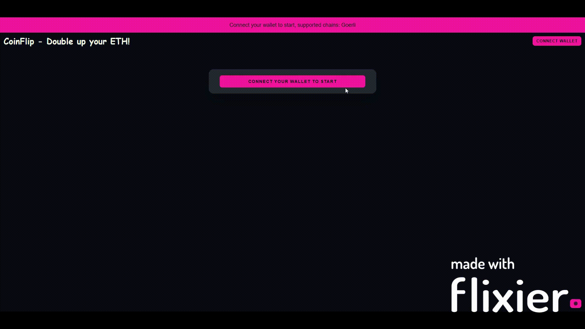
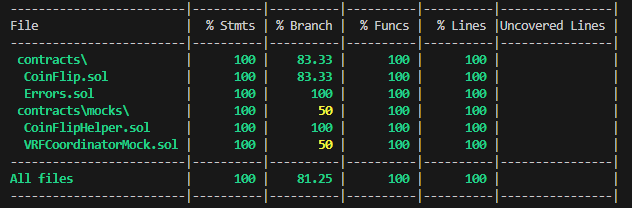

<div align="center">
<h1><strong> CoinFlip - Double up your ETH! </strong></h1>

[](https://academy.moralis.io)
[](https://github.com/Pedrojok01/CoinFlip_2.0/stargazers)
[](https://github.com/Pedrojok01/CoinFlip_2.0/issues)
[](https://github.com/Pedrojok01/CoinFlip_2.0/blob/main/License)
[](https://www.linkedin.com/in/pierre-e/)
[](https://app.netlify.com/sites/coinflip-double-up-your-eth/deploys)

</div>



## Table of Contents

- [Table of Contents](#table-of-contents)
- [Updates](#updates)
- [Description](#description)
- [Built With](#built-with)
- [Getting Started](#getting-started)
  - [Prerequisites](#prerequisites)
  - [Smart-Contracts Deployment](#smart-contracts-deployment)
    - [Install the dependencies](#install-the-dependencies)
    - [Deployement](#deployement)
    - [Coverage](#coverage)
    - [Static Analyzer](#static-analyzer)
  - [Config \& Client](#config--client)
- [Acknowledgments](#acknowledgments)
- [Use](#use)
  - [⭐️ ... and don't forget to leave a star if you like it! ⭐️](#️--and-dont-forget-to-leave-a-star-if-you-like-it-️)

## Updates

- 2024/06 - Move from Truffle to Hardhat & Switch to Spolia network & Update to Chainlink VRF 2.5 & compiler to 0.8.20 & Clean contracts/app;
- 2022/07 - Switch to Chainlink VRF v2 & Update solidity compiler version to 0.8.7;
- 2022/12 - Switch to Goerli network v2 & upgrade all deps & Update solc to 0.8.16;

## Description

Decentralized application (Dapp), EVM compatible, built as a part of the programming course: Ethereum201 on [academy.moralis.com](https://academy.moralis.io).

The app is a simple coin flip game where you can double up your ETH or lose your bet. The game is based on a smart contract that uses Chainlink VRF to generate a random number.

Smart contracts deployed on Sepolia testnet: [0x097d039Bb7353B0bcD3d585B5a71e8B575F2f3f7](https://sepolia.etherscan.io/address/0x097d039Bb7353B0bcD3d585B5a71e8B575F2f3f7#code)

Try it yourself: [coinflip-double-up-your-eth.netlify.app/](https://coinflip-double-up-your-eth.netlify.app/)

## Built With

- [![React][react.js]][react-url]
- [![solidity]][solidity-url]
- [![chainlink]][chainlink-url]
- [![hardhat]][hardhat-url]
- [![ethers.js]][ethers-url]

## Getting Started

### Prerequisites

Make sure you have the following ready:

- [node.js](https://nodejs.org/) installed (developed on LTS v20.12.0)
- [yarn](https://yarnpkg.com/) installed
- [hardhat](https://hardhat.org/) installed
- [MetaMask](https://metamask.io/) installed in your browser

Then create a new repo, open your favorite code editor, and clone the repo with the following cmd:

```bash
git clone https://github.com/Pedrojok01/CoinFlip_2.0 .
```

### Smart-Contracts Deployment

#### Install the dependencies

In your terminal, make sure you are in the `COINFLIP_2.0` repo, then move to the blockchain folder :

```bash
cd blockchain
```

Then run the following command to install the dependencies:

```bash
yarn install
```

#### Deployement

To deploy your smart-contracts:

- Subscribe to Chainlink VRF v2.5 on the [Chainlink VRF Sepolia dashboard](https://vrf.chain.link/sepolia/). You can get some test LINK there: [LINK Faucet](https://faucets.chain.link/).
- Add your <b>subscription id</b> to the deployment script in `blockchain/scripts/deploy.js`. To deploy on different chains, you will also have to adjust the `COORDINATOR` and `KEY_HASH` values. You can refer to the [Chainlink docs](https://docs.chain.link/vrf/v2-5/supported-networks#configurations) to get the data for the desired network (if supported).
- Also, make sure that the network is configured in `hardhat.config.js` and that you have defined the required variables in the `.env` file.
- Edit the script in `blockchain/package.json` to deploy the contract on the network of your choice.
- Finally, run the command below to deploy to the network of your choice.

```bash
yarn deploy
```

#### Coverage

To check the coverage of the tests, run the following command:

```bash
yarn cover
```

And see the results printed in the terminal:



#### Static Analyzer

For basic security checks, you can run both [Slither](https://github.com/crytic/slither) and [Aderyn](https://github.com/Cyfrin/aderyn) (refer to their doc to install them) with the following commands:

```bash
yarn slither
```

```bash
yarn aderyn
```

Aderyn will print a nice report file called `report.md` at the root of the project.

### Config & Client

Before each deployment, make sure to:

- Replace the contract address in `src/data/constants.js`
- Replace the abi file in `src/data/coinFlipAbi.js`
- Make sure to fund the contract with some ETH ( [Faucet for the Sepolia network](https://goerlifaucet.org/) )

---

- Change the `COINFLIP_ADDRESS` in `/src/constants.js` to your deployed contracts address;
- Copy the new abi file into the `src/abis` folder if you've made any changes to the contracts;
- Enable/disable, and update the suitable networks in `truffle-config.js`;
- In the `blockchain/` repo, create a file called `.secret` and paste your mnemonic seed phrase inside; (<b>Make sure you add this file in your `.gitignore`!!!</b>)

<!-- ACKNOWLEDGMENTS -->

## Acknowledgments

- [Img Shields](https://shields.io)
- [Font Awesome](https://fontawesome.com)
- [Jazzicon](https://github.com/MetaMask/jazzicon)

## Use

You are now set to start your local server. Make sure you're still in `COINFLIP 2.0` and type:
`yarn start`

<br/>

<div align="center">
<h2># Enjoy!!!</h2>

### ⭐️ ... and don't forget to leave a star if you like it! ⭐️

</div>

<p align="right">(<a href="#top">back to top</a>)</p>

<!-- MARKDOWN LINKS & IMAGES -->

[react.js]: https://img.shields.io/badge/React-20232A?style=for-the-badge&logo=react&logoColor=61DAFB
[react-url]: https://reactjs.org/
[chainlink]: https://img.shields.io/badge/chainlink-375BD2?style=for-the-badge&logo=chainlink&logoColor=61DAFB
[chainlink-url]: https://chain.link/
[solidity]: https://img.shields.io/badge/Solidity-35495E?style=for-the-badge&logo=solidity&logoColor=4FC08D
[solidity-url]: https://soliditylang.org/
[hardhat]: https://img.shields.io/badge/Hardhat-ffc517?style=for-the-badge&logo=data:image/png;base64,iVBORw0KGgoAAAANSUhEUgAAADoAAAA1CAYAAAAQ7fj9AAAAAXNSR0IArs4c6QAAAARnQU1BAACxjwv8YQUAAAAJcEhZcwAADsMAAA7DAcdvqGQAAAWUSURBVGhD7ZlrTFtlGIBPWwpt7VoRERghRCM44x+zwRKNmUbUwebmLZvXKWjihSnxD7DE/VgCS3Qui9nUqD82My8bsokzjggbl82BBgcMGDCGQwKMoQiFcR8br9/7wam9vOfSnm5xXX88Sdtze5++3/d+7zlHiF2cCDcCIdFgIyQabIREA8VTT8bA5k23wIdbb+bUlJs44vec7ChIS4sjjw0kV0UUA0cZGBV8ovSgBZKXJJDn1MpVEa094rukyBe7bOQ5tRJQ0RUPLobqUhOM9OpJCTXgsTicA53ZgIjiUG2vM8KVYQHmRmgBX0FhnMOBEtYkGhefCGUlZrj8j8C5MkQHrYWe1jB4mhU06vq+4LfoKxuiYbxXB7N/CU7mWEapYAPB/i+tmrLrl+i7G6Ng5oIAl1yYHaAD9KT9pJn8XQ0tv4X7Leuz6J5PF8HMecGLy4N0cJ5kvhQDX+9OJrepAWVTl8eTscnhk2jOW1Ew3SuQzDnowFwp3muA1JQ4WP9cOgx0XtvMqhZdnRELkz0CTBFM99EBuTLBhvcdt5u56Oo1a6BgSwq5n1pOnQgn45RClWh8QiI4OnUw2S2Q4BylgnFlc64RLBaLUxRp/jWK3FcVbBmrZd0XFS+FKtHyA2aY+JNlRQJcWshgFuhq0oHNZvYSzXo1jdxfLXjd11+7lYzZE0XRR1gzMHGOCcmg1CSsWhnBJT1FES2FCUWHuvRk3J4oirbVGGH8D0GSSZZRKgiRH741OCUpUSxMY/1G8lglsEHBabNzm3J/LCuamhoPY50CjJ2VZopVXCoIZPpvAZLuNMmKIju23UserwS2nLi0DXYqZ1VW9NBXFrjYIcgy008HgVQf1oPdPj83RZYToplZaX5nVaz8z6+/jXQQkRUdbtPBaLsgyyzLGhWASHeLDjIeo+foumfTNc1RBNdwrPwNVfLLjaTo46tiYaSN3UUoINfIX2BDu6Nexz+XfGPgw1gUzc+739k0aFlmcOpMdAngOKsjPUQkRffssoLjNDuBAkoV9503jPAeW0OxYUA+KIiE2opYvg1FN+Xdp0kUm5VxVvmRZSnSraGk6OljYaSYG630xV2ZYnc1dy8x8Wwe2mdw/o5DFjP7+cf3uO3vK1gjeMFk7NhqJ10QSdH+ej04WpiMDDhHqYt70viLDqzW+aL0wjozbxRQ8u2NK/wuQiLTrOqKhbGqRLpTkhQdZN3McLMgC85R6uIU2wvDuOhdyRZnMTrXZCP39QUcuhfPzOOXKGZsuEmeERVDVwTn8qMPRzhFtVZbEay6o+wPR5qrjKQLIilKiXniS0YRrMIpS2/iFZfa7g+4vI2weoGcb5BuHCRFh06xPlIBLEjUxeX4sciq6V7UE+yMHGwaIX2srlAuiLRoI5NBmBAOC2zesQPBE+PzIWyoA/XETws4dMUR1nfSR9HMDdH8BLzr+R/IqOHSABu6LQbJ1xteoviYgjrR9QT1tN9LlDoQnwc1HguH5uNGqDhggqrvTdBRp23984fG6nA4Wmzi4GepGPCViKcXKdrxuxFO/BQBx0si4Ey1watRwImP62jldxGaXj+oBYXqDxv/qxse4LbKoggoKzJDX6tBnWh5kYmvj24slG/e9nkIt1cYeLapAANB5UETKSfHJ+8vcnNCvESTkxMgOysKjuwzORdifqfiIu0mvJDdhlIjVLGgcEjhv0oFrQbMHh+i7A9vO2ogRSi6a/Swe7sVXnwm2s1HxEvUkycyYiA/JxJ2Ftq4fE+d3lt4QZaXeVxjiUACSUtZGPy81wQFuXZ48+UoeOgB5RfJiqJSLFsaD2vTYziF+XYozLNDAaP4MwsPQgoxSDk+2mLjEkhudiSsXcmuw0hKusbvXq5HQqLBRkg02AiJBhsh0WAjJBps3CCiifAv+kBDzN+k+08AAAAASUVORK5CYII=
[hardhat-url]: https://hardhat.org/
[ethers.js]: https://img.shields.io/badge/Ethers.js-2535a0?style=for-the-badge&logo=data:image/png;base64,iVBORw0KGgoAAAANSUhEUgAAADcAAAAwCAYAAAC13uL+AAAAAXNSR0IArs4c6QAAAARnQU1BAACxjwv8YQUAAAAJcEhZcwAADsMAAA7DAcdvqGQAAALVSURBVGhD7ZjPSxdBGIf7Z7p1ky51CS928qQnu5SH9BIeAiFJEAwPVgfx5EkIBCEIgkAIBEEQBOlP2ny+MDDfl8/uvjM7U23s4SHNd2fez7y/ZvfBw8enzf/KJG6sTOLGyiSuBE+enzfPlr/OUH+vQVVxC4tnzebby+bw+K45Ovk1x9a7q+pCq4lbe30hRVkQ+ejpF7nGUKqII1pKSBvvD26qCCwubv3NTymgj+29a7neEIqKo4as0x8+3zbLa99n9Rfslla/zcRY29WXP+bWG0pRcfufbuecJT2VXQAxsT01WjI9i4kjOrGjWztX0s5in3uxcSHtcsgWRwq+uq8vmkHsHHxMjAAHYdcAIkn6rtxHOE5rL8niGMaqXmL60tHCmmodC+NFPd9GkjgagWd2kWrq+S52RQYoUg7OLY7T7RLGpjQI0jWnKcTXMw6R9UhvtZe3q7rE4azthAHmWo0BDNSZiqi3q7rE0cHsBpCTfqkggllp9/ZEzyVORa30wO3Cjgvw3Gh6xZEadmFOUtnWguhZH0DZxvSKU1eqPxm1gKo9ZRfTK07VG4KVrZec59VsVXYxf0VcTiOqIk6lJXNI2XphzdTrlG1qnrrPEjf0couwlLpVTY35qmxjesWpTuW98XdBmnmHP7cV64Mn8r3iQN3avY61Qd157olqxnkzxyVObZDTFCxEjw9EKgpLK/ptvfjFWV2BSrw183wQwL+g3g8DnjqLcYkD9c6VcopdkAXq/higLHLGj1scqPRE4NAIBjhAxgw1RTdFUO7aPJckDtjcvmcxg4bOvlRwHvHUJofO/vzOAYUDSRYHNADVnqkXvnewgXouheA88HkBqEnqjr09kc0SF0Akm7V9IsAZumFwrg1sQkOhUZEZ/IwIUpSoeOaaZZC4GDbnJHEGwcHZAAdg/w877CFESa2dSzFx/yKTuLEyiRsrk7ixMokbK5O4cXLa/Ab0j7hz1hk9uQAAAABJRU5ErkJggg==
[ethers-url]: https://docs.ethers.io/v6/
